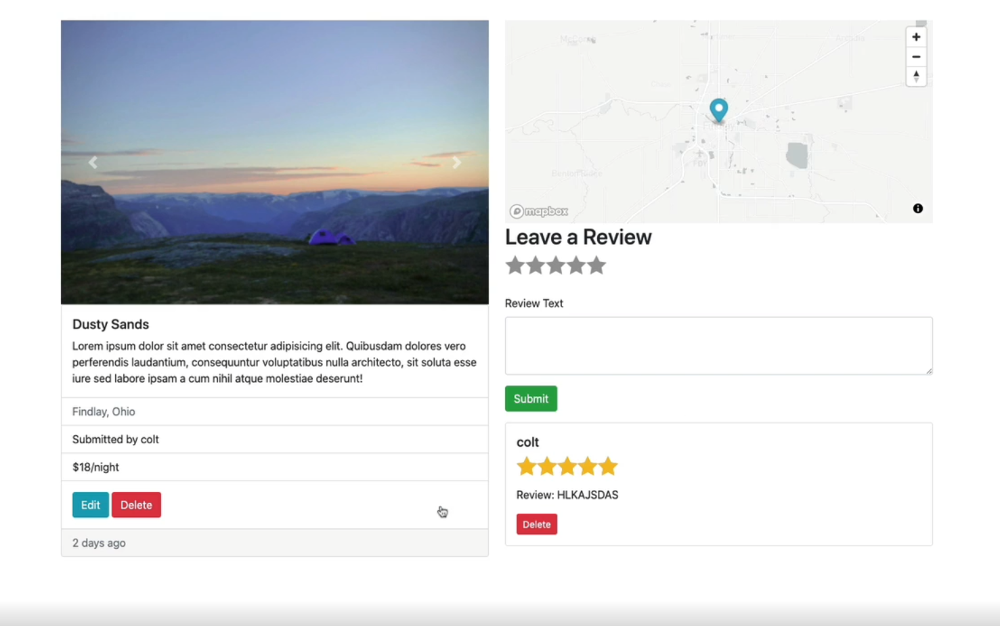

# YelpCamp

YelpCamp is a web application that allows users to discover and review campsites. Users can create accounts, add new campgrounds, leave reviews, and comment on others' reviews. YelpCamp is built using Node.js, Express.js, MongoDB, and Bootstrap.
This project is inspired by Colt Steele's Web Developer Bootcamp on Udemy.

## Features

- User Authentication: Users can sign up for an account or log in with their existing credentials.
- Campground Management: Logged-in users can add new campgrounds, edit or delete their own campgrounds, and view details of each campground.
- Reviews and Comments: Users can leave reviews for campgrounds and comment on reviews left by others.
- Responsive Design: The application is designed to be responsive and work seamlessly across different devices and screen sizes.
- Flash Messages: Flash messages are used to provide feedback to users for actions such as logging in, adding a new campground, etc.

## Technologies Used

- Frontend: HTML, CSS, JavaScript, Bootstrap
- Backend: Node.js, Express.js
- Database: MongoDB
- Authentication: Passport.js
- Templating Engine: EJS (Embedded JavaScript)
- Other Dependencies: mongoose, body-parser, express-session, connect-flash, method-override

### Images

Home page

Campgrounds

Single Campground

